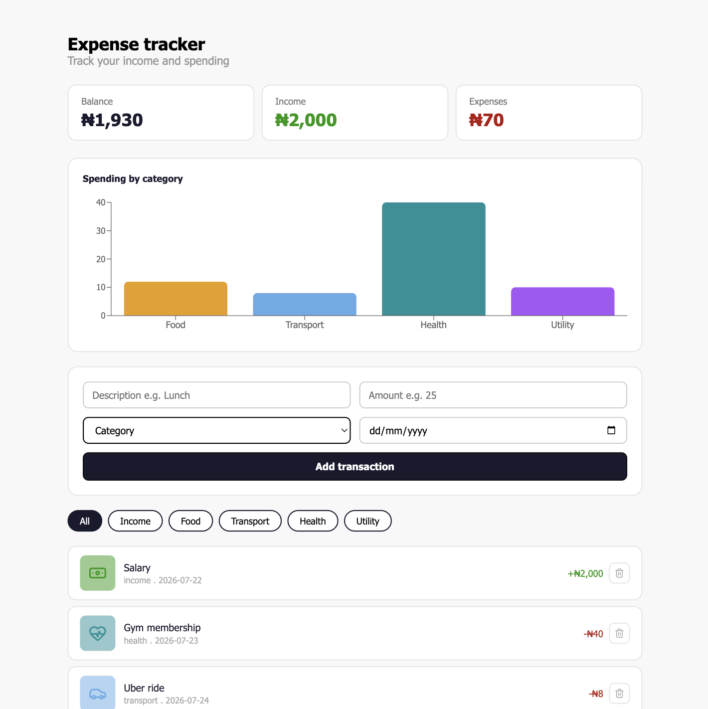

# Expense Tracker

A React app for tracking personal income and expenses, with real-time balance calculations, category filtering, and a spending chart.

## Features

- Add income and expense transactions
- Automatic sign handling - expenses go negative based on category
- Real-time balance, income and expenses summary
- Spending breakdown chart by category using Recharts
- Filter transactions by category
- Delete transactions
- Category icons with colour coded backgrounds
- Data persists across page refreshes using localStorage
- Responsive design - works on mobile, tablet and desktop

## Tech Stack 

- React
- Vite
- SCSS
- Recharts (bar chart)
- Lucide React (icons)

## Getting Started

### Prerequisites
- Node.js v18+

### Installation

1. Cllone the repo
    git clone https://github.com/YOUR_USERNAME/expense-tracker-react.git

2. Install dependencies
    npm install

3. Start the dev server
    npm run dev

4. Open your browser at http://localhost:5173

## Project Structure

src/
├── components/
│   ├── Summary.jsx          ← balance, income, expenses cards
│   ├── SpendingChart.jsx    ← bar chart grouped by category
│   ├── TransactionForm.jsx  ← form to add a transaction
│   ├── FilterBar.jsx        ← category filter tabs
│   ├── TransactionList.jsx  ← renders the transaction list
│   └── TransactionItem.jsx  ← single transaction row with delete
├── styles/
│   ├── summary.scss
│   ├── spendingChart.scss
│   ├── transactionForm.scss
│   ├── filterBar.scss
│   ├── transactionList.scss
│   └── transactionItem.scss
├── App.jsx
└── App.css

## How It Works

- Income transactions are stored as positive numbers
- Expense transactions are stored as negative numbers
- Balance is calculated as income + expenses
- The chart groups expenses by category and sums the totals
- All data is saved to localSktorage so nothing is lost on refresh

## What I Learned

- Managing and deriving state from a single source of truth
- Performing calculations with reduce and filter on state arrays
- Passing functions as props across multiple component levels
- Using a third party library (Recharts) in a React project
- Storing and retrieving complex data with localStorage
- Lazy state initialization with useState
- SCSS responsive layouts with nested media queries
- Preventing NaN errors with Number() conversion and validation

## Screenshots

| Desktop | Tablet | Mobile |
|---------|--------|---------|
|  | ! [Tablet](screenshots/expense-tracker-tablet.png) | ! [Mobile](screenshots/expense-tracker-mobile.png)

## Future Improvements

- Edit existing transactions
- Monthly view to filter by date range
- Pie chart for income vs expenses breakdown
- Export transactions as CSV
- Set monthly budget limits with warnings